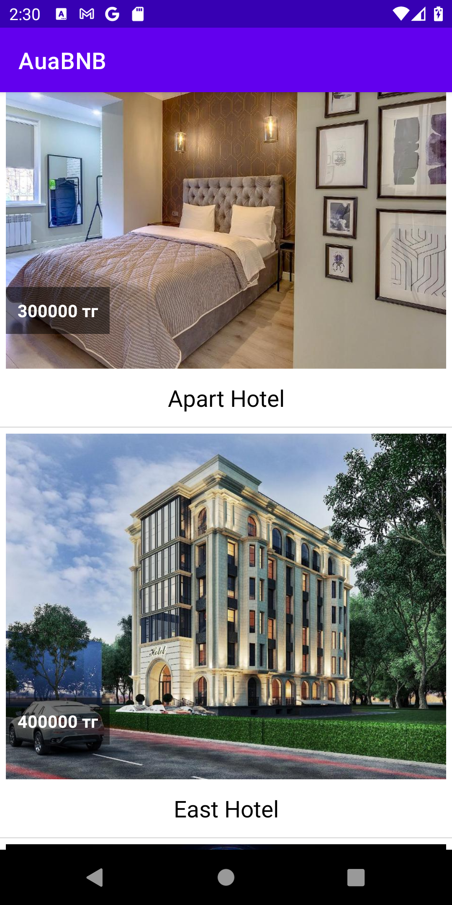

# auaBNB
AirBNB-inspired application that shows the list of apartments and hotels available in chosen city.
* Used [Backendless](https://backendless.com/)-backend server for storing data
* and [Glide libraries](https://github.com/bumptech/glide) to display images

 

idea credits to : Bakytzhan Baizhikenov(youtube channel)
